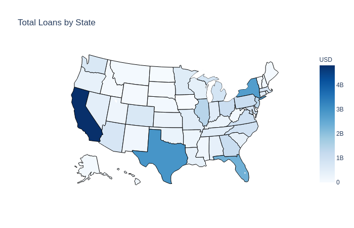
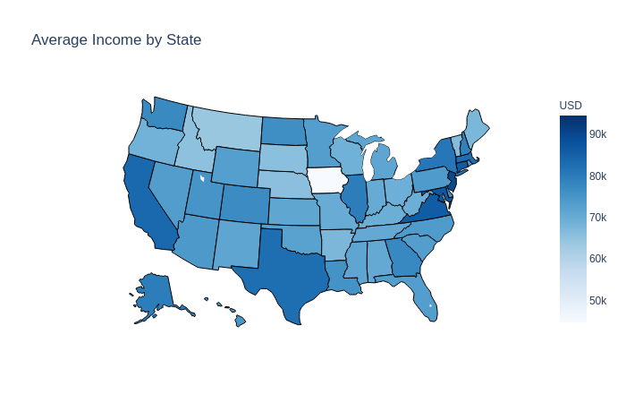

# Lending Club - Loan Data Analysis

## Context

Lending Club is a US-based peer to peer lending company and represents the world's largest peer-to-peer lending platform. At a high level, investors provide funds for potential borrowers and investors earn a profit depending on the risk they shoulder based on borrower credit score.

For more information about Lending Club, please refer to the [wikipedia article](https://en.wikipedia.org/wiki/LendingClub).

# Table of Contents
1. [Motivation](README.md#Motivation)
2. [Dataset](README.md#Dataset)
3. [Analysis](README.md#Analysis)
4. [Architecture](README.md#Architecture)
5. [Installation](README.md#Installation)

## Motivation

LendingClub enables borrowers to create unsecured personal loans between \$1,000 and \$40,000.
Investors can search and browse loan listings on the Lending Club website and invest in loans based on the information supplied about the borrower, loan value, loan grade, and loan purpose.
Investors make money from interest while LendingClub generates revenue by charging borrowers an origination fee and investors a service fee.

We will leverage this data to 1) perform exploratory data analysis and 2) construct a production pipeline architecture.

For the exploratory data analysis piece, we will load the data into a Jupyter notebook, perform necessary cleanup + aggregations, generate visualizations, and summarize our findings.

For the production pipeline architecture, we will build a prototype of a data pipeline that will feed an analysis system (data warehouse).
This system will in turn be used by data scientists / analysts to query and explore the data for machine learning model training and evaluation.
The pipeline should accommodate periodic data updates over time and process updates in a robust and efficient manner.

## Dataset

The main `loan.csv` file [(download)](https://www.kaggle.com/wendykan/lending-club-loan-data) contains complete loan data for all loans issued through the 2007-2018, including the current loan status (Current, Late, Fully Paid, etc.) and latest payment information.
Additional features include credit scores, number of finance inquiries, address including zip codes, state designation, and collections.

The csv file is a table of ~2.3 million rows spanning ~145 columns. A data dictionary is provided in the separate `LCDataDictionary.xslx` file.

## Analysis

For the purposes of this analysis, we will focus on loan activity at the state level.
This will provide insight into which states have higher operating activity and allow us to visualize findings using a choropleth map.
In turn, we will dig into whether higher activity is attributable to factors such as personal income or risk.

Located in the `/src` folder is a Jupyter notebook (`exploratory-analysis`) that walks through each step in the below analysis.
Below summary is kept high level, but please refer to the Jupyter notebook for code and further detail.

### Key Metrics

To determine which states have higher operating activity, we will calculate the following three metrics by state:

- Total Loans
- Average Annual Income
- Average Interest Rate

### Findings

Based on the below choropleth, New York, California, Texas, and Florida have the highest amount of absolute loans across all states.

Diving deeper, we can see below that these four states have an interest rate of about 13%, which is roughly equivalent to the average national interest rate (13.11%).
Therefore, interest rate is likely not a strong predictor for why most loans are issued in these four states.

| addr_state |  loan_amnt_sum | annual_inc_avg | int_rate_avg |
|------------|:--------------:|---------------:|--------------|
| NY         | $2,767,160,700 |        $81,057 |       13.26% |
| CA         | $4,808,480,100 |        $83,848 |       12.98% |
| TX         | $2,931,133,525 |        $82,729 |       13.00% |
| FL         | $2,333,034,500 |        $73,172 |       13.16% |
| NATIONAL   | $666,982,700   |        $74,148 |       13.11% |

What about average income? Well New York (81k), California (84k), and Texas (83k) are well above the average national income (74k), which may explain why most loan activity comes from those three states.
Note here that Florida bucks the trend as it has average state income (73k) close to average national income, but still has high loan activity.

## Architecture

---WILL REPLACE IMAGE BELOW---

### Data Acquisition

---WILL REPLACE TEXT BELOW---

Data is acquired by running JSON-RPC calls from a full Bitcoin Core node.

Run `./json-rpc-pase-all-blocks.sh` in `/src/bash` directory to deserialize Bitcoin block data into JSON and write into dedicated AWS S3 bucket.
This must be run from a full Bitcoin Core node with transaction indexing enabled (see [here](https://www.buildblockchain.tech/blog/btc-node-developers-guide) for setup instructions)

### Ingestion

---WILL REPLACE TEXT BELOW---

BitWatch runs on top of a Spark cluster (one c5.large for master, three c5.2xlarge for workers) and a single PostgreSQL instance (one m4.large).

Data is ingested with Spark from an S3 bucket that holds JSON files (one file for each blockchain block).

Results are then written out to PostgreSQL in a tabular format in a `transactions` table (each row represents one transaction).

(See Installation section below) Run `process-json.py` in `src/spark` directory using `spark-submit` command in PySpark to ingest JSON files from AWS S3 bucket.

## Installation

PostgreSQL installation will occur on AWS EC2 instances for deployment, but can also be configured on local machine for testing purposes.

If going through the below instructions for AWS EC2 setup, please familiarize yourself with setting up security groups in AWS [here](https://docs.aws.amazon.com/vpc/latest/userguide/VPC_SecurityGroups.html).

### PostgreSQL

We will use a dedicated PostgreSQL instance to store data and facilitate automatic updates.

We will launch an EC2 instance using the **Ubuntu Server 18.04 LTS (HVM), SSD Volume Type** m4.large image type and set root volume storage to 1 TB.
Then [SSH into the instance](https://docs.aws.amazon.com/AWSEC2/latest/UserGuide/AccessingInstancesLinux.html) and run the following commands:

    # run update and install PostgreSQL
	sudo apt update
	sudo apt install postgresql postgresql-contrib
	
	# start PostgreSQL and check status
	sudo systemctl start postgresql
	sudo systemctl status postgresql
	
	# log in as default postgres user
	sudo -u postgres -i
	
	# change default postgres user password
	psql ALTER USER postgres PASSWORD 'myPassword';
	
All configuration files are stored here:

    /etc/postgresql/10/main
    
The `postgresql.conf` and `pga_hba.conf` files are the most relevant for configuring a database.

    #postgresql.conf
    #listen_addresses = 'localhost' # what IP address(es) to listen on;
                                    # comma-separated list of addresses;
                                    # defaults to 'localhost'; 
                                    # use '*' for all
                                    # (change requires restart)
    port = 5432                     # (change requires restart)
    max_connections = 100           # (change requires restart)
    ...

Change `listen_addresses` to `*` instead of `localhost` and restart postgres service using `sudo systemctl restart postgresql`.

The `pga_hba.conf` file controls which hosts are allows to connect.
Add the following line under the IPv4 section in that file:

    host    <database>      <user>       0.0.0.0/0        md5

The PostgreSQL instance should now be setup and ready for remote connection.
