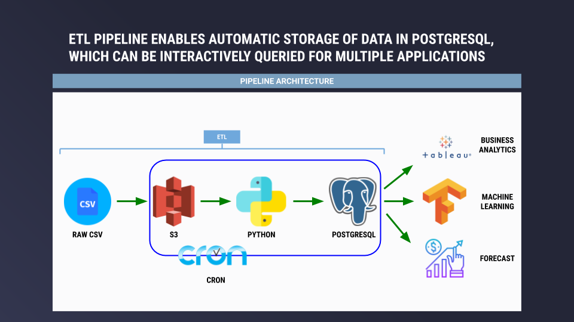

# Lending Club - Loan Data Analysis

## Context

Lending Club is a US-based peer to peer lending company and represents the world's largest peer-to-peer lending platform. At a high level, investors provide funds for potential borrowers and investors earn a profit depending on the risk they shoulder based on borrower credit score.

For more information about Lending Club, please refer to the [wikipedia article](https://en.wikipedia.org/wiki/LendingClub).

# Table of Contents
1. [Motivation](README.md#Motivation)
2. [Dataset](README.md#Dataset)
3. [Analysis](README.md#Analysis)
4. [Architecture](README.md#Architecture)
5. [Installation](README.md#Installation)
6. [Directory Structure](README.md#Directory-Structure)

## Motivation

LendingClub enables borrowers to create unsecured personal loans between \$1,000 and \$40,000.
Investors can search and browse loan listings on the Lending Club website and invest in loans based on the information supplied about the borrower, loan value, loan grade, and loan purpose.
Investors make money from interest while LendingClub generates revenue by charging borrowers an origination fee and investors a service fee.

We will leverage this data to 1) perform exploratory data analysis and 2) construct a production pipeline architecture.

For the exploratory data analysis piece, we will load the data into a Jupyter notebook, perform necessary cleanup + aggregations, generate visualizations, and summarize our findings.

For the production pipeline architecture, we will build a prototype of a data pipeline that will feed an analysis system (data warehouse).
This system will in turn be used by data scientists / analysts to query and explore the data for machine learning model training and evaluation.
The pipeline should accommodate periodic data updates over time and process updates in a robust and efficient manner.


## Dataset

The main `loan.csv` file [(download)](https://www.kaggle.com/wendykan/lending-club-loan-data) contains complete loan data for all loans issued through the 2007-2018, including the current loan status (Current, Late, Fully Paid, etc.) and latest payment information.
Additional features include credit scores, number of finance inquiries, address including zip codes, state designation, and collections.

The csv file is a table of ~2.3 million rows spanning ~145 columns. A data dictionary is provided in the separate `LCDataDictionary.xslx` file.


## Analysis

For the purposes of this analysis, we will focus on loan activity at the state level.
This will provide insight into which states have higher operating activity and allow us to visualize findings using a choropleth map.
In turn, we will dig into whether higher activity is attributable to factors such as personal income or risk.

Located in the `/src` folder is a Jupyter notebook (`exploratory-analysis`) that walks through each step in the below analysis.
Below summary is kept high level, but please refer to the Jupyter notebook for code and further detail.

### Key Metrics

To determine which states have higher operating activity, we will calculate the following three metrics by state:

- Total Loans
- Average Annual Income
- Average Interest Rate

### Findings

Based on the below choropleth, New York, California, Texas, and Florida have the highest amount of absolute loans across all states.


Diving deeper, we can see below that these four states have an interest rate of about 13%, which is roughly equivalent to the average national interest rate (13.11%).
Therefore, interest rate is likely not a strong predictor for why most loans are issued in these four states.

| addr_state |  loan_amnt_sum | annual_inc_avg | int_rate_avg |
|------------|:--------------:|---------------:|--------------|
| NY         | $2,767,160,700 |        $81,057 |       13.26% |
| CA         | $4,808,480,100 |        $83,848 |       12.98% |
| TX         | $2,931,133,525 |        $82,729 |       13.00% |
| FL         | $2,333,034,500 |        $73,172 |       13.16% |
| NATIONAL   | $666,982,700   |        $74,148 |       13.11% |

What about average income? Well New York (81k), California (84k), and Texas (83k) are well above the average national income (74k), which may explain why most loan activity comes from those three states.
Note here that Florida bucks the trend as it has average state income (73k) close to average national income, but still has high loan activity.


## Architecture

The ETL data pipeline consists of multiple steps from storage of raw csv files to final write out into a database storage system.



### Raw CSV

Inputs to the pipeline are in the form of standalone csv files.
Each csv file is assumed to have consistent columnar format and type.

### AWS S3

The pipeline must be able to process the existing large `loan.csv` file in addition to any "new" csv files.
We will leverage AWS S3 as a centralized data lake for warehousing the existing `loan.csv` file in addition to any "new" csv files.

### Python

The pipeline will then leverage Python to clean up + process csv files and write out into a database storage system (PostgreSQL).

__Future Consideration__: if the size and number of new csv files exceeds memory / computing constraints for a single computing instance, distributed processing solutions such as Spark can be substituted for this stage.

### PostgreSQL

Given the relatively small dataset (~2 GB, ~2.3 million rows, 145 columns), PostgreSQL is an appropriate relational database solution.
Queries on datasets of this size range within the sub-second to second range, depending on available RAM and query complexity.
Data schema and table creation / population statements can be found in the `src/loan-schema.sql` file.
However, `the build_db.py` file (executed in `run.sh` file) automatically creates and populates the `loans_db` database using the `loan.csv` file.

Note that using the native COPY command in SQL drastically improves write performance when populating the `loans` table in PostgreSQL (<1 minute).
Compare this to reading in the `loan.csv` file into a pandas DataFrame and writing that out to PostgreSQL using the `df.to_sql()` method (>5 hours).

__Future Consideration__: if the size of stored data starts to strain a standalone PostgreSQL setup, AWS Redshift may be an appropriate choice for storing large amounts of data adhering to a relational model.
However, given the large number of "empty" columns in the `loan.csv` file, it may also be wise to pursue a columnar solution such as Cassandra or HBase.
These NoSQL solutions would only be appropriate if relational queries are limited and if other constraints are satisfied (i.e., consistency and availability in CAP theorem).

Current implementation stores all `loan.csv` data in a single table, but future schema may include multiple tables in a star schema format.
This would be particularly important for columns that store values with list validation (i.e., can only take a restricted set of values).

### Automated Updates

This pipeline may receive periodic updates of the dataset over time, which will need to be processed in a robust and efficient way.
We will leverage a daily Cron job to facilitate automated updates.
The benefit of using Cron is that it is "out of the box" given it is built into Linux and is fairly reliable for simpler jobs.

__Future Consideration__: if the pipeline needs to accommodate more complex workflows and dependencies when updating the data, it may be worthwhile to integrate Airflow as a task scheduler and workflow monitor.


## Installation

PostgreSQL installation will occur on AWS EC2 instances for deployment, but can also be configured on local machine for testing purposes.

If going through the below instructions for AWS EC2 setup, please familiarize yourself with setting up security groups in AWS [here](https://docs.aws.amazon.com/vpc/latest/userguide/VPC_SecurityGroups.html).


### PostgreSQL

We will use a dedicated PostgreSQL instance to store data and facilitate automatic updates.

We will launch an EC2 instance using the **Ubuntu Server 18.04 LTS (HVM), SSD Volume Type** m4.large image type and set root volume storage to 1 TB.
Then [SSH into the instance](https://docs.aws.amazon.com/AWSEC2/latest/UserGuide/AccessingInstancesLinux.html) and run the following commands:

    # run update and install PostgreSQL
	sudo apt update
	sudo apt install postgresql postgresql-contrib
	
	# start PostgreSQL and check status
	sudo systemctl start postgresql
	sudo systemctl status postgresql
	
	# log in as default postgres user
	sudo -u postgres -i
	
It is recommended to create a separate user instead of leveraging the existing 'postgres' superuser.
Guide for creating a separate user can be found [here](https://chartio.com/resources/tutorials/how-to-change-a-user-to-superuser-in-postgresql/), but for simplicity we will work with the 'postgres' superuser.
	
	# change default postgres user password
	psql ALTER USER postgres PASSWORD 'myPassword';
	
All configuration files are stored here:

    /etc/postgresql/10/main
    
The `postgresql.conf` and `pg_hba.conf` files are the most relevant for configuring a database.

    #postgresql.conf
    #listen_addresses = 'localhost' # what IP address(es) to listen on;
                                    # comma-separated list of addresses;
                                    # defaults to 'localhost'; 
                                    # use '*' for all
                                    # (change requires restart)
    port = 5432                     # (change requires restart)
    max_connections = 100           # (change requires restart)
    ...

Change `listen_addresses` to `*` instead of `localhost` and restart postgres service using `sudo systemctl restart postgresql`.

The `pga_hba.conf` file controls which hosts are allows to connect.
Add the following line under the IPv4 section in that file:

    host    <database>      <user>       0.0.0.0/0        md5

The PostgreSQL instance should now be setup and ready for remote connection.

### Run Instructions

Once PostgreSQL has been set up, we can create and populate the loan data from `loan.csv` by running the `./run.sh` file.

Please note that python3 may need to be specified in the `run.sh` script depending on which interpreter is used.

## Directory Structure
 
 ```
├── README.md
|
├── data
|    ├── README.md
|
├── images
│    ├── income-avg.png
│    ├── loan-total.png
│    ├── pipeline.png
|
├── src
│    ├── buildDB.py
│    ├── config.py
│    ├── exploratoryAnalysis.ipynb
│    ├── loanSchema.sql
│    ├── updateDB.py
│    ├── run.sh
``` 